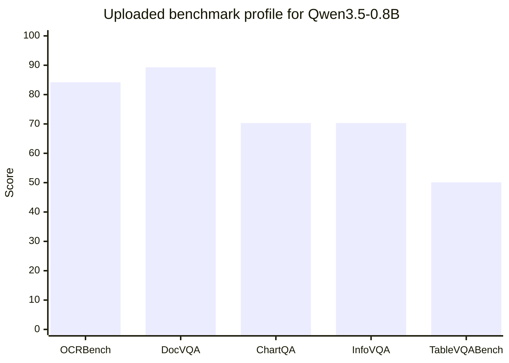
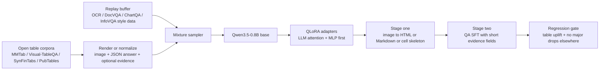
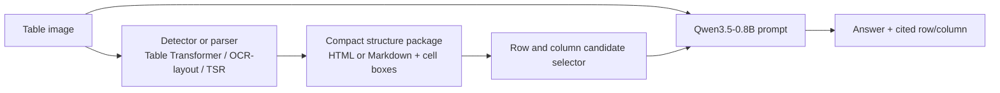
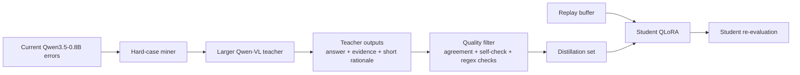

# Light Proof of Concept for Closing the Visual Table QA Gap in Qwen3.5-0.8B

## Executive summary

This report treats the uploaded project brief as the operative problem statement. In that brief, Qwen3.5-0.8B is the strongest model among the six shortlisted sub-1B VLMs, but its weakest benchmark is visual table question answering: **50.1 on TableVQABench**, versus **84.2 on OCRBench**, **89.3 on DocVQA**, and **70.3 on ChartQA**. In other words, the bottleneck is not general document perception; it is **table-specific visual grounding and reasoning**. The same brief also notes a likely cutting-edge Qwen3.5 architecture, possible MoE/gated-delta internals, and the need to verify PEFT compatibility instead of assuming it. fileciteturn0file0

Because the original request said the “gap” was unspecified, the plausible interpretations were broad: model performance, data bias, deployment latency, privacy, and domain adaptation. Based on the uploaded brief and very recent literature, the three most likely gaps are: **structure-aware table grounding**, **resolution/token-budget limits for dense tabular layouts**, and **specialising for tables without causing regressions on OCR/DocVQA/ChartQA/InfoVQA**. The evidence is consistent across recent work: TableVQA-Bench shows that visual tables are harder than text-formatted tables and are sensitive to image/query resolution; ViTaB-A shows that row/column attribution lags answer accuracy; and recent table/document VLM work repeatedly improves results by adding structure supervision, layout signals, or reasoning traces. citeturn8view0turn23view0turn26view0turn30view1

The lightest PoC with the best expected return is **error-targeted multitask QLoRA on Qwen3.5-0.8B**, using a mixture of visual table QA, auxiliary table-structure supervision, evidence-formatted outputs, and a small replay buffer from non-table document tasks. That recommendation is grounded in four strands of evidence: recent Qwen-family work emphasises dynamic resolution and structured extraction from tables; MMTab/Table-LLaVA shows that table-recognition pretraining plus instruction tuning improves multimodal table understanding; CoReTab shows that verifiable reasoning supervision improves table QA/fact verification/structure tasks; and recent domain-specific Qwen2.5-VL LoRA work on financial tables shows that narrow visual-document fine-tuning can produce very large gains over the untuned base model. citeturn9view1turn29view0turn30view1turn24view0

The strongest fallback, if adapter hooks on the new Qwen3.5 release prove brittle, is a **hybrid structure-assist pipeline** that extracts a compact HTML/Markdown or cell graph first and then prompts the small VLM with both the image and the structure. That path is less elegant and increases latency, but it is highly plausible because TableVQA-Bench, layout-modality work on financial table QA, and intermediate-structure work all point in the same direction: **making latent table structure explicit helps reasoning**. citeturn8view0turn26view0turn27view0turn39view0

The table below compares the proposed PoCs. “Expected uplift” is an implementation estimate, not a result reported in the literature.

| PoC | Core idea | Why it is plausible | Estimated TableVQA uplift | Inference latency | Engineering risk | Recommendation |
|---|---|---|---:|---|---|---|
| **Error-targeted multitask QLoRA** | Fine-tune Qwen3.5-0.8B with visual table QA + structure warm-up + evidence outputs + replay | Aligns with MMTab/Table-LLaVA, CoReTab, and narrow-domain Qwen2.5-VL LoRA results | **+4 to +8** | None to minimal | Medium | **Recommended** |
| **Hybrid structure-assist pipeline** | Table detector/TSR or OCR-layout stage builds compact table representation, then Qwen answers from image + structure | Supported by TableVQA-Bench, layout-modality, and intermediate-structure literature | +3 to +6 | Moderate increase | Low to medium | Good fallback |
| **Same-family teacher distillation** | Larger Qwen-VL teacher labels hard cases with answer, evidence, and short rationale; student gets QLoRA | Supported by Table-R1-style distillation logic and multimodal GKD tooling availability | +3 to +7 | None after training | Medium to high | Strong follow-on |

## Gap definition

The uploaded benchmark makes the first interpretation of the gap straightforward: **the model’s weakest capability is visual table understanding, not general OCR, document QA, or chart reading**. Using the uploaded numbers, TableVQABench is **39.2 points below DocVQA**, **34.1 below OCRBench**, **20.2 below InfoVQA**, and **20.2 below ChartQA**. It is also the benchmark with the largest remaining headroom despite Qwen3.5-0.8B already leading the six-model shortlist. fileciteturn0file0

Recent literature suggests that this “table gap” is not one single defect. It is better understood as three coupled failure modes. The first is **structure-aware grounding**: models can read many tokens on a page, but still fail to reliably bind a question to the correct row, column, header hierarchy, or evidence cell. ViTaB-A shows a clear gap between answering and attribution, with attribution often much worse and column attribution harder than row attribution. TableVQA-Bench similarly shows that table understanding from images is materially harder than from structured text representations. citeturn23view0turn23view1turn23view2turn8view0

The second is a **representation and token-budget problem**. TableVQA-Bench reports that the number of vision queries matters for performance and that efficiency drops when image-formatted tables induce very long visual token sequences. In parallel, Qwen2-VL/Qwen2.5-VL, DocOwl2, and PaddleOCR-VL all emphasise dynamic resolution or aggressive compression as core enablers for document and table understanding under realistic compute budgets. citeturn8view0turn3academia3turn9view1turn32view0turn33view0

The third is **specialisation without regression**. The brief explicitly asks for no regressions on OCRBench, DocVQA, ChartQA, and InfoVQA, and recent multimodal continual-tuning work shows that this concern is well founded. Model Tailor, Fwd-Prompt, and SMoLoRA each document different forms of catastrophic forgetting or transfer interference in multimodal tuning, including loss of general instruction following and visual understanding when a model is adapted too narrowly. fileciteturn0file0 citeturn37view0turn38view0turn38view2

The other plausible interpretations of the originally unspecified “gap” are still worth noting, but they are less likely here. Deployment latency is important in edge VLM work and is actively addressed by token compression and compact models such as DocOwl2, SmolDocling, and PaddleOCR-VL. Domain adaptation is also relevant, especially for finance-heavy subdomains such as FinTabNetQA. Privacy is a plausible product concern but does not appear to be the primary blocker in the uploaded benchmark. Data bias remains real, especially because many public table corpora over-represent scientific or Wikipedia-style tables, but the benchmark evidence points first to **reasoning over visual structure**, not merely to a demographic or language bias issue. citeturn32view0turn31view0turn33view0turn35view0



The chart above simply visualises the uploaded benchmark spread: the table gap is not subtle; it is the single largest capability deficit in the current profile. fileciteturn0file0

A practical assumption is necessary here. I did **not** locate a public technical report for the exact Qwen3.5-0.8B vision model variant surfaced in the uploaded brief, so architecture-specific remarks beyond the brief rely on the **Qwen2-VL / Qwen2.5-VL / Qwen3-VL family** and on current fine-tuning frameworks that already support adjacent Qwen vision families. That is enough to design a credible PoC, but not enough to skip a smoke test for adapter injection. fileciteturn0file0 citeturn16view4turn36view1

## Recent literature

The recent literature is unusually consistent about what improves table understanding in small or mid-sized multimodal systems. It clusters around five ideas: **better benchmarks**, **explicit table pretraining**, **layout/structure as first-class information**, **reasoning supervision**, and **compact document-specific architectures**. The table below summarises the most relevant 2023–2026 sources, with a few older foundational datasets included only where they are still load-bearing.

| Source | Main contribution | Key datasets / scale | Metrics used | What matters for your PoC |
|---|---|---|---|---|
| **TableVQA-Bench** 2024 citeturn8view0 | Benchmark for visual table QA across multiple domains; visual tables harder than text tables | 894 images, 1,500 QA over VWTQ, VWTQ-Syn, VTabFact, FinTabNetQA | Accuracy; relieved accuracy for FinTabNetQA | Use as **evaluation**, not core training data |
| **MMTab / Table-LLaVA** 2024 citeturn29view0 | Large-scale multimodal table dataset plus table-specialised MLLM | 150K recognition samples, 232K instruction samples, 49K eval samples; 14 datasets, 8 domains | Multiple table-task benchmarks | Best open training source for a light table-specialisation PoC |
| **Qwen2-VL** 2024 and **Qwen2.5-VL** 2025 citeturn3academia3turn9view1 | Dynamic resolution, document parsing, structured extraction from forms/tables | Family-level technical reports | Broad benchmark suite | Strong architectural support for a Qwen-based table PoC |
| **DocOwl2** 2024 citeturn32view0 | High-resolution compression for long documents | Compresses high-res pages to 324 visual tokens | Multi-page doc benchmarks | Supports crop/compression or curriculum ideas |
| **SynFinTabs** 2024 citeturn35view0 | Synthetic financial tables plus layout QA model | Large synthetic financial-table corpus | Task-specific extraction metrics | Useful for finance-heavy table slices and harder layouts |
| **Visual-TableQA** 2025 citeturn22view0 | Reasoning-intensive synthetic visual table QA; fine-tuning transfers | ~2.5K tables, 6K QA | External generalisation after fine-tuning | Good source for hard synthetic reasoning cases |
| **Layout modality for Japanese securities reports** 2025 citeturn26view0 | Layout + text + image improve TableCellQA over image-only | 10,278 train / 1,303 test | Accuracy, ANLS | Strong evidence for explicit row/column/layout signals |
| **Financial VQA with intermediate structured representations** 2025 citeturn27view0 | Structured intermediate tables improve reasoning over direct image-only access | 50K chart-to-table pairs in the paper’s setup | RMS, RNSS, QA comparison | Supports structure-assist fallback pipeline |
| **Fine-tuned Qwen2.5-VL for financial table markdown** 2025 citeturn24view0 | Narrow LoRA tuning produces large gains on complex financial tables | 2,152 image-text pairs; held-out 100 tables | Criteria-based accuracy, Markdown TEDS | Strong evidence that **small, careful domain tuning works** |
| **CoReTab** 2026 citeturn30view1 | Code-driven verified reasoning traces for multimodal table understanding | 115K verified samples | QA, fact verification, structure benchmarks | Best recent evidence for reasoning-trace supervision |
| **ViTaB-A** 2026 citeturn23view0 | Evaluates evidence attribution in table QA | Multiple model families, multiple formats | QA accuracy vs attribution accuracy | Justifies evidence-labelled outputs in training and eval |

The benchmark layer is important because it tells you what **not** to optimise blindly. TableVQA-Bench intentionally spans a mix of skills: direct QA over Wikipedia tables, synthetic variants, table fact verification, and financial tables with relaxed numeric evaluation. It therefore captures more than plain OCR. Its authors also show that the same content is easier in HTML or Markdown than in image form, which is exactly why this gap persists even in otherwise capable VLMs. citeturn8view0

The dataset and pretraining layer has moved fast since 2024. MMTab is especially relevant because it does not just provide QA pairs; it also provides **table-recognition pretraining data**, and Table-LLaVA’s two-stage recipe explicitly uses image-to-HTML-style supervision before downstream instruction tuning. That matters because it suggests a lightweight student can first be taught to “see” the table layout, then to answer questions about it. CoReTab pushes the same idea further by adding **verifiable intermediate reasoning**, with gains on table QA, fact verification, and structure tasks. citeturn29view0turn30view1

The strongest recent document-VLM papers also converge on the idea that dense documents require **token discipline**. Qwen2-VL and Qwen2.5-VL emphasise dynamic-resolution processing and robust structured extraction from tables. DocOwl2 compresses each high-resolution page to 324 tokens and reports lower latency with far fewer visual tokens. PaddleOCR-VL shows that a compact 0.9B document model can still handle tables effectively with a dynamic-resolution encoder. SmolDocling reaches competitive document-conversion performance with only 256M parameters. Together, these papers argue that you should not assume “larger image = better answer” unless the model and preprocessing are specifically designed to preserve useful structure under a bounded token budget. citeturn3academia3turn9view1turn32view0turn33view0turn31view0

A separate but highly relevant thread focuses on **making structure explicit**. The Japanese securities-report paper lifts TableCellQA accuracy by more than seven points over image-only input by adding text and layout features. Financial VQA work using intermediate structured representations finds that giving the model a structured table alongside the image improves reasoning compared with direct image queries alone. And the broader “Table as a Modality” work argues that simple serialisation loses structural semantics and that tables behave better when treated as an independent modality rather than flattened text. These results strongly support either auxiliary structure supervision during training or a structure-assist inference pipeline. citeturn26view0turn27view0turn39view0

Finally, the adaptation literature matters because the project brief explicitly prohibits regressions. LoRA remains the baseline PEFT method; QLoRA is still the standard memory-efficient route for quantised tuning; DoRA can improve low-rank adaptation quality but currently brings more overhead and, in the Hugging Face PEFT docs, only supports linear and Conv2D layers. More importantly, the multimodal continual-tuning literature shows that narrow SFT can degrade original capabilities, which is why replay, conservative adapter scope, or dual-routing ideas should be part of the PoC rather than an afterthought. citeturn11academia1turn11academia0turn10academia0turn16view2turn37view0turn38view2

On tooling, the ecosystem is in good shape for adjacent Qwen families even if the exact Qwen3.5-0.8B variant needs confirmation. LLaMA-Factory already lists support for Qwen2.5-VL and Qwen3-VL families, while ms-swift supports lightweight multimodal LoRA/QLoRA/DoRA, T4/V100-class hardware, quantised training, and multimodal GKD. That opens a practical route for both the recommended QLoRA PoC and the teacher-distillation option. citeturn16view4turn36view1turn36view2turn36view0

## Likely residual failure modes in Qwen3.5-0.8B

Because the uploaded benchmark summary does not include per-subdomain scores for Qwen3.5-0.8B, the decomposition below is **an inference grounded in the benchmark design and the recent literature**, not a reported score breakdown. That inference is still useful for PoC design because the benchmark slices map fairly cleanly onto different table abilities. fileciteturn0file0 citeturn8view0

The most likely first failure mode is **row/column attribution under visually dense layouts**. ViTaB-A shows that current multimodal models are much worse at attribution than at final answering, and especially weaker on columns than rows. That is exactly the kind of hidden failure that can drag down table QA even when OCR is relatively strong: the model sees many tokens correctly, but binds the question to the wrong structural locus. In practice, this should be most visible in wide tables, multi-level headers, and tables whose answer requires jointly identifying one row group and one column group. citeturn23view0turn23view1turn23view2

The second likely failure mode is **fact verification and “semantic row/column matching”**, which points to the **VTabFact** slice. TableVQA-Bench explicitly includes a fact-verification domain, and recent reasoning work such as Table-R1 and CoReTab shows that additional reasoning traces or verifiable rewards can improve fact verification on tables. That suggests the base small VLM is probably underperforming not because it cannot read the table at all, but because it lacks consistent internal procedures for checking claims against the correct cells. citeturn8view0turn21view2turn30view1

The third likely failure mode is **numeric normalisation and unit handling**, especially in **FinTabNetQA-like financial tables**. TableVQA-Bench’s own design relaxes financial-table evaluation by stripping units because strict accuracy is too difficult for current multimodal systems. Financial-table literature adds the same warning: units, rotated layouts, implicit columns, and multi-level headers frequently confuse otherwise capable VLMs. In other words, even if the correct cell is found, answer rendering can still fail because numerical value, scale, and label are not normalised consistently. citeturn8view0turn24view0turn35view0

The fourth likely failure mode is **layout shift**, especially for synthetic or out-of-distribution rendering styles. TableVQA-Bench includes both authentic and synthetic visual tables. Visual-TableQA, SynFinTabs, SmolDocling, and synthetic-data work for table recognition all reinforce the same point: style diversity, spanning cells, and domain-specific layouts matter, and synthetic data can help if it is realistic enough. That means a student trained only on generic web or document imagery will probably remain brittle on unusual header structures, missing gridlines, or finance-style spanning cells unless the training mix explicitly covers them. citeturn8view0turn22view0turn35view0turn31view0turn5academia1

From a design standpoint, the useful distinction is between what is **fixable by post-training** and what is mostly **architecture-bounded**. Post-training should plausibly improve structural grounding, evidence localisation, financial units, and fact verification through better data and supervision. What it probably cannot fully solve is the deeper architectural mismatch between serial token processing and two-dimensional table semantics. Recent table-modality work argues that flattening tables into plain text fundamentally loses structure, and TableVQA-Bench shows that even strong models pay a penalty when forced to reason from visual tables rather than structured text. That is why this report recommends a light PoC, not an expectation of full closure. citeturn39view0turn8view0

## PoC designs

### Error-targeted multitask QLoRA

This is the recommended PoC because it preserves the product shape of a **single small model**, adds no mandatory inference-stage pipeline, and is best aligned with recent table-specific adaptation results. The design principle is simple: make the student learn three things jointly—**table structure**, **answering**, and **evidence alignment**—while using replay to cap regressions. The direct inspiration comes from MMTab’s two-stage recipe, CoReTab’s verified reasoning signals, and narrow-domain Qwen2.5-VL LoRA gains on complex financial tables. citeturn29view0turn30view1turn24view0



**Required datasets.** Use **MMTab-pre** and **MMTab-instruct** as the core open training substrate, because they already cover table recognition, QA, fact verification, and structure understanding over diverse domains. Add **Visual-TableQA** for reasoning-intensive synthetic tables, **SynFinTabs** for financial layouts, and optionally **PubTables-v2** or **PubTables-1M** when you want extra page-level or cropped-table structure supervision. Keep **TableVQA-Bench as evaluation/dev-only** rather than a main training source, because it is small and benchmark-oriented. citeturn29view0turn22view0turn35view0turn34view0turn35view3turn8view0

**Preprocessing.** Normalise all samples into a unified schema such as:

```json
{
  "image": "...",
  "question": "...",
  "answer": "...",
  "evidence": {"row_text": "...", "col_text": "...", "cell_text": "..."},
  "task_type": "qa|fact_verification|structure",
  "table_repr": "<optional html or markdown>"
}
```

You do not need full chain-of-thought. A **short evidence field** is enough and is safer operationally: one row cue, one column cue, optional cell text, then final answer. That is directly motivated by ViTaB-A’s attribution gap and by CoReTab’s finding that explicit, verifiable intermediate structure improves performance. citeturn23view0turn30view1

**Model choices.** Start with **QLoRA** rather than full LoRA because memory headroom matters more than maximum capacity in an initial PoC. Attach adapters first to the language stack’s attention and MLP projections. Only expand to the multimodal projector or vision-linguistic bridge if the first run underfits the table tasks. This is the conservative path because LoRA/QLoRA are the best-understood baseline PEFT methods, while DoRA adds more overhead and narrower layer support in current PEFT documentation. citeturn11academia0turn11academia1turn16view2

**Training plan.** Use two short stages. Stage one is a structure warm-up on image-to-HTML, image-to-Markdown, or image-to-cell-skeleton tasks, echoing the MMTab/Table-LLaVA pattern. Stage two is mixed supervised fine-tuning on QA and fact verification, with outputs constrained to a compact JSON schema. Keep **15–25% replay** from non-table data that resembles OCRBench/DocVQA/ChartQA/InfoVQA capabilities to avoid over-specialisation; the exact replay source can be any legally usable internal or open set that approximates those skill families. The no-regression rule should be enforced as a hard gate during checkpoint selection. citeturn29view0turn37view0turn38view2

**Evaluation.** The primary target metric is the same TableVQABench accuracy used in the uploaded brief. Add three auxiliary diagnostics: **TEDS/GriTS** on structure tasks, **row/column attribution exact match or F1** in a ViTaB-A-style dev slice, and **task-type breakdown** across QA, fact verification, and finance-style numeric answers. For the financial slice, include both strict and unit-relaxed accuracy because TableVQA-Bench explicitly distinguishes those cases. fileciteturn0file0 citeturn17academia3turn34view0turn23view0turn8view0

**Compute and time.** Estimated only: on a **single T4/L4-class GPU**, a light QLoRA run over roughly **15K–40K mixed samples** should be feasible as a PoC with gradient accumulation and one to three epochs. Expect roughly **one workday or less** on an L4 and **roughly one workday** on a T4 for a compact initial run, with faster iteration if you trim the structure warm-up. This is a practical estimate, not a published figure, but it is consistent with current multimodal PEFT tooling that already targets T4/V100-class hardware and quantised training. citeturn36view2turn36view3

**Strengths and limitations.** Strengths: preserves a one-model deployment path; directly attacks the likely error sources; aligns with strong recent evidence. Limitation: it still relies on the base model’s native visual encoder and table inductive biases, so the ceiling may remain below larger Qwen-VL siblings or specialist structure-heavy pipelines. Recent work treating tables as an independent modality is a reminder that data alone may not fully erase an architecture-level mismatch. citeturn24view0turn29view0turn30view1turn39view0

### Hybrid structure-assist pipeline

This PoC assumes that the small VLM’s main problem is not raw OCR but **implicit structure recovery**. It therefore inserts a narrow first stage that extracts compact structural context before asking the VLM to answer. This is the strongest fallback if Qwen3.5 adapter support is unstable or if a no-training path is preferred initially. The literature behind it is straightforward: TableVQA-Bench shows that structured formats are easier than images; explicit layout features help TableCellQA; and intermediate structured representations improve downstream reasoning. citeturn8view0turn26view0turn27view0



**Required datasets.** For the structure stage, use **PubTables-1M**, **PubTables-v2**, **FinTabNet-style data**, and **SynFinTabs** depending on your target domain. For evaluation, stay with the uploaded benchmark plus a small attribution-oriented dev set. PubTables-v2 is attractive here because it adds page context and multi-page tables, while PubTables-1M remains a strong canonical source for cropped-table structure. citeturn35view3turn34view0turn35view0

**Preprocessing.** Convert the first-stage output into a compact prompt format instead of dumping the whole table. A good compromise is: table title or caption if present, top-level header path, candidate row snippets, candidate column snippets, then final selected cell neighbourhood. That is much closer to how a retrieval system would expose evidence than to a full serialisation of the table; it also keeps prompt length bounded. The Japanese layout-modality paper is especially relevant here because it shows that a small amount of explicit layout information can materially improve performance. citeturn26view0

**Model choices.** For the parser, a lightweight Table Transformer-style model or OCR-layout stack is enough; for the reasoner, keep Qwen3.5-0.8B frozen at first. If the frozen pipeline helps but is still brittle, add a very small LoRA stage only on prompt-following and answer formatting. The main goal of this PoC is to see whether **making structure explicit** produces most of the gain without touching the VLM core. citeturn35view3turn35view4turn35view5turn26view0

**Training and evaluation plan.** Begin with **zero-shot or frozen** structure-assisted inference to estimate upside quickly. If that wins materially on TableVQABench with acceptable latency, add a small supervised tuning round over prompts that include the structure package. Evaluate strict answer accuracy, attribution correctness, and latency per sample. The main success criterion is whether the structure assist closes more of the gap than a comparable amount of lightweight fine-tuning. citeturn8view0turn23view0

**Compute and time.** Estimated only: this is the lowest-risk engineering path because most work is orchestration rather than training. A first PoC can often be assembled in **a few days** with open parsers and prompt templates. The downside is clear: latency rises because inference becomes multi-stage, and error propagation from the parser can cap gains. citeturn34view0turn35view3

**Strengths and limitations.** Strengths: robust fallback; easier to debug; naturally improves transparency because row/column evidence is explicit. Limitations: added latency, brittle parser-to-reasoner handoff, and more moving parts in deployment. It may outperform pure end-to-end tuning on finance-heavy or extremely wide tables, but it is a worse long-term product shape if you want a single elegant model. citeturn26view0turn27view0turn35view0

### Same-family teacher distillation

This PoC turns a larger Qwen-family model into a **data engine** rather than a runtime dependency. The idea is to mine the student’s current errors, have a stronger teacher produce compact answer-plus-evidence labels, filter them aggressively, and then QLoRA the student on those hard cases with replay. This is attractive because same-family distillation often reduces prompt-format mismatch, and current multimodal tooling now explicitly supports multimodal GKD. citeturn16view4turn36view0turn36view1



**Required datasets.** Start from the same open sources as the first PoC, but bias sampling toward the student’s hardest skill classes: attribution-heavy questions, numeric financial tables, and fact verification. The teacher then labels only the hardest subset. The practical teacher candidates are recent larger open Qwen vision families already visible in current fine-tuning frameworks, rather than opaque commercial systems. citeturn16view4turn36view1

**Preprocessing.** Keep teacher outputs short and verifiable. A good template is: `{answer, row_evidence, col_evidence, operation_type}`. Avoid long reasoning traces in the first PoC; CoReTab shows the value of verifiable intermediate reasoning, but a small student does not need full verbose traces to benefit. Recent table-reasoning work also suggests that distillation and verifiable rewards are particularly promising for fact verification and compositional table QA. citeturn30view1turn21view3

**Model choices.** Use a larger **same-family Qwen-VL teacher** if available in your environment, because that reduces modality and format drift. The student update should remain a simple QLoRA adapter. Multimodal GKD support in ms-swift makes this increasingly practical as a second-stage PoC. citeturn36view0turn36view1

**Training and evaluation plan.** First run the student and teacher on the same dev/hard sets. Keep only examples where the teacher is consistent under prompt perturbation or where answer-plus-evidence passes straightforward validators. Then mix those distilled hard examples with replay. Evaluate the same gates as in the first PoC. The real question is whether teacher-labelled hard cases buy you more uplift per GPU hour than broader open-data SFT. citeturn21view3turn30view1

**Compute and time.** Estimated only: moderate training cost, moderate teacher-inference cost, and no runtime penalty after deployment. Engineering risk is higher than the structure-assist pipeline because poor filtering can easily transfer teacher errors into the student. citeturn36view0

**Strengths and limitations.** Strengths: preserves one-model deployment; targets the exact failure frontier; easy to combine with the recommended PoC later. Limitations: more moving parts during training; harder data-quality control; possible teacher bias propagation. It is best viewed as **phase two** after the recommended PoC, unless your team already has a larger Qwen-VL teacher in active use. citeturn36view0turn36view1

## Recommended recipe and evaluation

The recommended option is **Error-targeted multitask QLoRA**, with a built-in regression gate and the option to add teacher-generated hard examples later. This recommendation follows directly from recent evidence. Compared with a structure-assist pipeline, it keeps deployment simpler. Compared with pure teacher distillation, it does not depend on an additional high-quality teacher from day one. Compared with full-model tuning, it is far safer and cheaper. And unlike a pure prompt-only solution, it adapts the model’s internal preferences for evidence localisation and table formatting. citeturn24view0turn29view0turn30view1turn11academia0turn11academia1

The concrete training recipe should be:

| Component | Recommendation |
|---|---|
| Base model | Qwen3.5-0.8B from the uploaded brief, pending adapter smoke test |
| Tuning method | QLoRA first; expand adapter scope only if underfitting |
| Data mix | ~50–60% table QA and verification, ~20–30% structure warm-up, ~15–25% replay |
| Output format | Compact JSON with `answer`, `row_evidence`, `col_evidence`, optional `operation_type` |
| Curriculum | Structure warm-up first, then mixed QA/verification |
| Gate to ship | TableVQABench up materially; other benchmark families not down beyond pre-declared tolerance |

The most important practical choice is the **evaluation gate**. Because the uploaded brief explicitly wants “no regressions,” define that before training. A sensible PoC gate is: **TableVQABench improves by at least 3 absolute points**, while OCR/DocVQA/ChartQA/InfoVQA proxies do **not decline by more than 1 point each** relative to the uploaded baseline, unless the drop is within bootstrap uncertainty. That threshold is an implementation assumption, not a literature constant, but it makes the brief’s requirement operational. fileciteturn0file0

To make the gain interpretable, split the evaluation into four subskill buckets, even if you have to label them heuristically at first:

| Subskill | How to proxy it | Why it matters |
|---|---|---|
| Structure grounding | multi-level-header questions, wide tables, cell-path evidence | likely primary bottleneck |
| Fact verification | VTabFact-like true/false items | captures claim checking over correct evidence |
| Numeric normalisation | finance-style values with units, percentages, totals | catches “found right cell but said wrong number/unit” |
| Attribution | row/column evidence scoring | distinguishes real structure use from lucky answers |

That subskill split is important because answer accuracy alone can hide fragile behaviour. ViTaB-A shows that evidence attribution is a separate failure mode, not a trivial by-product of answering. If the PoC improves answer accuracy but not row/column evidence, expect poor robustness under distribution shift. citeturn23view0

A second recommendation is to keep the **adapter scope conservative** at first. The uploaded brief already warns that the exact Qwen3.5 architecture may be bleeding-edge and that PEFT support must be verified rather than presumed. Current public tooling strongly supports adjacent Qwen-VL families and multimodal LoRA/QLoRA, but that is not the same as a proven recipe for this exact release. A one-hour smoke test that loads the model, injects adapters, runs one forward pass, and saves a checkpoint is worth more than any amount of speculative hyperparameter tuning. fileciteturn0file0 citeturn16view4turn36view1turn16view2

## Delivery plan

A light but rigorous delivery plan can fit into a short research sprint.

| Milestone | Deliverable | Exit criterion |
|---|---|---|
| **Environment validation** | Model loads, adapters attach, one short training loop works | Successful smoke test on one batch |
| **Error audit** | 150–300 manually or heuristically labelled hard examples by subskill | Clear ranking of failure types |
| **Data pack build** | Unified training mixture with table, structure, and replay splits | Reproducible manifest and held-out eval split |
| **Baseline PoC run** | First QLoRA model checkpoint | Meets or exceeds baseline without large regressions |
| **Ablation pass** | Compare: no structure warm-up, no evidence fields, no replay | One clear winning recipe |
| **Ship decision** | Recommended checkpoint and report | Passes pre-declared gate |

A compact milestone schedule would look like this:

| Sprint window | Focus |
|---|---|
| **Days one to two** | Environment + adapter smoke test + error audit |
| **Days three to five** | Dataset unification + prompts + training recipe |
| **Days six to eight** | First QLoRA run + regression checks |
| **Days nine to ten** | Ablations + hard-case analysis + recommendation |

A minimal reproducible repository can be very small:

```text
table-gap-poc/
  README.md
  pyproject.toml
  configs/
    model/qwen35_08b.yaml
    train/qlora_table.yaml
    eval/regression_gate.yaml
  data/
    build_mixture.py
    render_tables.py
    label_subskills.py
    make_replay_buffer.py
  prompts/
    answer_with_evidence.jinja
    structure_warmup.jinja
  train/
    smoke_test_adapters.py
    run_structure_warmup.py
    run_table_sft.py
  eval/
    run_benchmarks.py
    eval_subskills.py
    eval_attribution.py
    regression_gate.py
  pipelines/
    structure_assist.py
    teacher_distill.py
  notebooks/
    hard_case_review.ipynb
```

The core functions should be:

- `build_mixture.py`: ingest MMTab, Visual-TableQA, SynFinTabs, and any internal replay data into one normalised JSONL format.
- `label_subskills.py`: assign provisional labels such as `fact_verify`, `numeric`, `lookup`, `header_reasoning`.
- `smoke_test_adapters.py`: verify adapter injection, one batch forward/backward, checkpoint save/load.
- `run_structure_warmup.py`: image-to-structure training stage.
- `run_table_sft.py`: mixed QA fine-tuning.
- `eval_attribution.py`: score row/column evidence in a compact dev slice.
- `regression_gate.py`: fail fast if non-table benchmarks move outside accepted bounds.

The resource checklist is short but important:

| Resource | Minimum need | Notes |
|---|---|---|
| Model | Qwen3.5-0.8B weights and tokenizer | exact architecture smoke-test required |
| Training framework | ms-swift or LLaMA-Factory + PEFT + Transformers | pin versions for reproducibility |
| GPU | T4/L4-class minimum for PoC; stronger GPU shortens iteration | estimate only |
| Data | MMTab, Visual-TableQA, SynFinTabs, optional PubTables-v2 | keep TableVQA-Bench eval-only |
| Evaluation | existing benchmark harness plus attribution script | preserve uploaded baseline settings |
| Logging | seed, config, commit hash, dataset manifest | mandatory for no-regression claims |

The most important non-obvious resource is **version pinning**. The uploaded brief explicitly flags a likely cutting-edge Qwen3.5 build and possible architectural novelty, while public tooling currently advertises support for neighbouring Qwen families and multimodal PEFT. That combination is workable, but only if you freeze the software stack once the smoke test passes. fileciteturn0file0 citeturn16view4turn36view1turn15view2

The bottom line is this: the unspecified “gap” is best operationalised here as a **visual table-structure reasoning gap** with secondary concerns about **token-efficient resolution handling** and **regression-free specialisation**. The recommended light PoC is a **two-stage, error-targeted QLoRA adaptation** of Qwen3.5-0.8B using recent open table corpora, compact evidence supervision, and replay. That is the best balance of scientific plausibility, engineering effort, and deployment simplicity given the benchmark profile and the state of the 2023–2026 literature. fileciteturn0file0 citeturn8view0turn29view0turn30view1turn23view0turn36view1